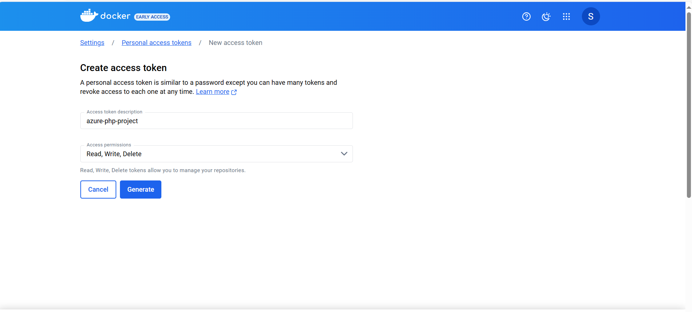

# CI/CD Pipeline with Docker Hub, Azure DevOps, and Kubernetes

This project is a CI/CD setup for a PHP-based Boat application. The pipeline is configured using Azure DevOps, Docker Hub, and Kubernetes, with the project being deployed using Minikube. Below are the detailed steps to set up and run the CI/CD pipeline.

## Table of Contents

- [Technologies Used](#technologies-used)
- [Dockerfile Creation](#dockerfile-creation)
- [Azure DevOps Pipeline Setup](#azure-devops-pipeline-setup)
  - [1. Create a New Project](#1-create-a-new-project)
  - [2. Configure Agent Pool](#2-configure-agent-pool)
  - [3. Install Docker on Agent Server](#3-install-docker-on-agent-server)
  - [4. Service Connection to Docker Hub](#4-service-connection-to-docker-hub)
  - [5. Setup Database Connection](#5-setup-database-connection)
  - [6. Initialize Git Repository](#6-initialize-git-repository)
  - [7. Configuring Open Access for Pipelines](#7-configuring-open-access-for-pipelines)
  - [8. Create and Run CI Pipeline](#8-create-and-run-ci-pipeline)
- [Kubernetes Deployment](#kubernetes-deployment)
- [Pipeline Automation](#pipeline-automation)
- [Conclusion](#conclusion)

## Technologies Used

- **PHP**: Backend programming language used for developing the Boat application.
- **Docker**: Containerization platform used to build and deploy the application.
- **Azure DevOps**: CI/CD platform used for creating pipelines, managing repositories, and deploying applications.
- **Docker Hub**: Container registry used to store and manage Docker images.
- **Kubernetes**: Container orchestration platform used for deploying and managing the application.
- **Minikube**: Local Kubernetes environment used for development and testing.
- **VMware Workstation**: Virtualization software used to host the Linux agent for Azure DevOps.
- **Azure Database**: Cloud-based database service used to store application data.
- **Visual Studio**: Integrated development environment (IDE) used for editing the project files.
- **Linux**: Operating system used for the build agent in the CI/CD pipeline.

## Dockerfile Creation

### Create a Dockerfile

- In project directory, create a `Dockerfile` to build the Docker image.
- Example `Dockerfile`:

     ```Dockerfile
     # PHP 7.3 sürümünü baz alan resmi PHP Apache görüntüsünü kullanýyoruz
     FROM php:7.3.33-apache

     # Apache mod_rewrite modülünü etkinleþtiriyoruz (URL yeniden yazýmý için gereklidir)
     RUN a2enmod rewrite

     # PHP eklenti gereksinimlerini kuruyoruz (örneðin: mysqli, pdo_mysql gibi)
     RUN docker-php-ext-install mysqli pdo_mysql

     # Çalýþma dizinini /var/www/html/caiwl altýna ayarlýyoruz
     WORKDIR /var/www/html/boat

     # Lokal projenizin dosyalarýný Docker görüntüsüne kopyalýyoruz
     COPY . .

     # Docker konteynerý açýldýðýnda Apache'yi baþlatýyoruz
     CMD ["apache2-foreground"]
     ```

- 

## Azure DevOps Pipeline Setup

### 1. Create a New Project

- Create a new project in Azure DevOps.
- 

### 2. Configure Agent Pool

- Navigate to **Project Settings > Agent Pools**.
- Create a new pool named `mypool` and configure it to include Linux agent hosted on VMware Workstation.
- 

### 3. Install Docker on Agent Server

- Install `Docker` and `zip` command on the server by running the following commands:

     ```bash
     sudo apt-get update
     sudo apt-get install -y docker.io
     sudo apt install zip
     ```

### 4. Service Connection to Docker Hub

- In **Project Settings > Service Connections**, create a new service connection of type `Docker Hub`.
- 
- Use Docker Hub credentials but replace the password with an `Access Token` generated from Docker Hub account.
- 
- 

### 5. Setup Database Connection

- The database connection is handled by **Azure Database**.
- Modify the `connection.php` file to include your database credentials. I create an example file named [connection-example.php](boat-project/database/connection-example.php) to keep my credentials secure.

### 6. Initialize Git Repository

- Initialize a Git repository for project in `Azure DevOps`.
- 
- Commit and push your code to the newly created Azure DevOps repository.
- 
- Verify that the files are successfully pushed by checking the **Repos** section in **Azure DevOps**.
- 

### 7. Configuring Open Access for Pipelines

In Azure DevOps, setting up open access allows all pipelines within your project to use a specific agent pool without requiring additional permissions. This streamlines the CI/CD process, ensuring that your pipelines have the necessary resources to run. Here's how you can configure this:

1. **Navigate to Agent Pools:**
   - In your Azure DevOps project, go to the **Project Settings** located at the bottom left of the sidebar.
   - Under **Pipelines**, select **Agent pools**.

2. **Open Pool Security Settings:**
   - Choose the agent pool you want to configure. In this case, the pool is named `mypool`.
   - Go to the **Security** tab.

3. **Set Open Access:**
   - Click on the "..." (more options) next to **Pipeline permissions**.
   - A dialog box will appear asking you to confirm open access. This will allow all pipelines in the project to use this resource without requiring explicit permissions.
   - 

4. **Confirm Open Access:**
   - In the confirmation dialog, click on **Open access** to proceed.
   - Once confirmed, all pipelines in your project will be able to utilize the resources in this agent pool without additional configuration.

This step ensures that your pipelines can run seamlessly using the designated agent pool, streamlining the CI/CD process in **Azure DevOps** project.

### 8. Create and Run CI Pipeline

- Create a new repository in Docker Hub for storing the Docker image.
- 
- Start creating a CI pipeline in **Azure DevOps**.
- 
Use the following sample [YAML file](boat-project\azure-pipelines.yml) for pipeline:

   ```yaml
   # Docker
   # Build a Docker image
   # https://docs.microsoft.com/azure/devops/pipelines/languages/docker

   trigger:
   - master

   resources:
   - repo: self

   stages:
   - stage: Build
     displayName: Build image
     jobs:
     - job: Build
       displayName: Build
       pool:
         name: mypool
         vmImage: ubuntu-latest
       steps:
       - task: Docker@2
         inputs:
           containerRegistry: 'docker-hub'
           repository: 'seyma1km/php-project'
           command: 'buildAndPush'
           Dockerfile: '**/Dockerfile'
           tags: 'latest'
   ```

- 
- 

- Save and run the pipeline.
- 

- Before running the pipeline, ensure the agent is running by executing the ./run script on your agent server.
- 

- Verify the Docker Image: on Docker Hub repository the latest tag should be present.
- 

## Kubernetes Deployment

### 1. Deploy Application with Kubernetes

- Use Minikube for deployment, although AKS (Azure Kubernetes Service) can also be used.
- Create a [deployment.yaml](deploy-image.yaml) file for Kubernetes:

   ```yaml
   apiVersion: apps/v1
   kind: Deployment
   metadata:
     name: php-app-deployment
   spec:
     replicas: 3
     selector:
       matchLabels:
         app: php-app
     template:
       metadata:
         labels:
           app: php-app
       spec:
         containers:
         - name: app-container
           image: seyma1km/php-project:latest
           imagePullPolicy: Always
           ports:
           - containerPort: 80
   ---

   apiVersion: v1
   kind: Service
   metadata:
     name: php-app-service
   spec:
     type: NodePort
     selector:
       app: php-app
     ports:
     - port: 80
       targetPort: 80
       nodePort: 30007
       
    ```

- Apply the deployment using:

   ```bash
   kubectl apply -f deployment.yaml
   ```

- 

### 2. Verify Deployment

- Open browser and navigate to the `http://<minikube_IP>:3007/boat` URL to verify that the deployment is successful.
- 

## Pipeline Automation

### Automatic Pipeline Trigger

- Once any change is pushed to the repository, the pipeline triggers automatically, builds a new Docker image with the latest tag.
- 

- To apply the update to the Kubernetes cluster, restart the deployment using the command:

   ```bash
   kubectl rollout restart deployment php-app-deployment
   ```

## Conclusion

This setup allows for a smooth **CI/CD** process for the PHP boat application, integrating **Docker Hub**, **Azure DevOps**, and **Kubernetes**. With this setup, every code change is automatically built, tested, and deployed in a consistent manner.
